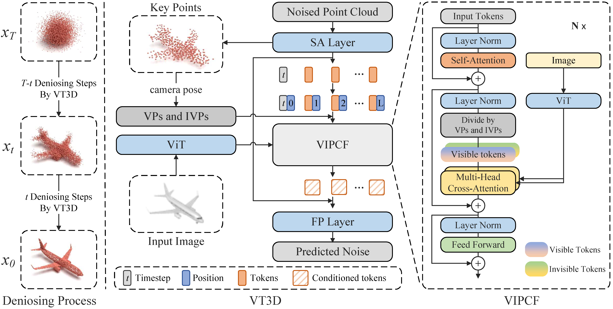

## VT3D: A Visibility-Driven Transformer-Based Diffusion Model for Single-View 3D Point Cloud Reconstruction

The source code will be released soon~

### Examples


### Method


# Installation

1. Create a conda environment: 
```
conda create --name vt3d python=3.10
conda activate vt3d
```

2. Install PyTorch 2.1.0 cu118 and PyTorch3D:
```
pip install torch==2.1.0 torchvision==0.16.0 torchaudio==2.1.0 --index-url https://download.pytorch.org/whl/cu118
conda install -c fvcore -c iopath -c conda-forge fvcore iopath
pip install --no-index --no-cache-dir pytorch3d -f https://dl.fbaipublicfiles.com/pytorch3d/packaging/wheels/py310_cu118_pyt210/download.html
```

3. Install requirements:
```
cd experiments
pip install -r requirements.txt
```


this repository modified from [PC^2](https://github.com/lukemelas/projection-conditioned-point-cloud-diffusion).
Thanks to Luke's fantastic job for point cloud reconstruction. 