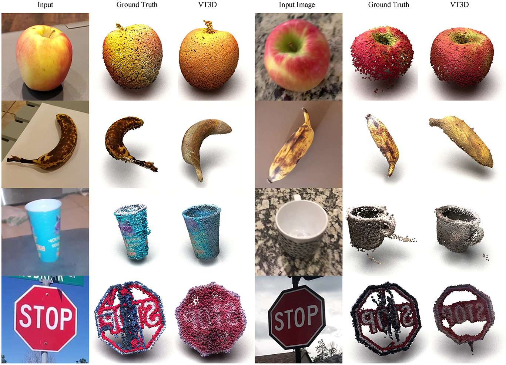

## VDTDM: A Visibility-Driven Transformer-Based Diffusion Model for Single-View 3D Point Cloud Reconstruction

The source code will be released soon~

### Examples


# Installation

# Installation

based on CUDA 11.8

1. Create a conda environment: 
```
conda create --name TrDPNet python=3.10
conda activate TrDPNet
```

2. Install PyTorch 2.1.0 cu118 and PyTorch3D:
```
pip install torch==2.1.0 torchvision==0.16.0 torchaudio==2.1.0 --index-url https://download.pytorch.org/whl/cu118
conda install -c fvcore -c iopath -c conda-forge fvcore iopath
pip install --no-index --no-cache-dir pytorch3d -f https://dl.fbaipublicfiles.com/pytorch3d/packaging/wheels/py310_cu118_pyt210/download.html
```

3. Install requirements:
```
cd experiments
pip install -r requirements.txt
```

# Dataset

## ShapeNet

1. **Download ShapeNet meshes**  
   Download the `.obj` mesh models from the [official ShapeNet website](https://shapenet.org/) (registration may be required).

2. **Convert meshes to point clouds**  
   Use [Open3D](http://www.open3d.org/) to sample point clouds from the `.obj` files. For example:

    ```python
   import open3d as o3d

   mesh = o3d.io.read_triangle_mesh("path/to/model.obj")
   pcd = mesh.sample_points_uniformly(number_of_points=8192)
   o3d.io.write_point_cloud("path/to/output.ply", pcd)

3. **Download rendered images**  
   Download rendered RGB images from the [3D-R2N2 repository](https://github.com/chrischoy/3D-R2N2), which provides multi-view renderings aligned with the ShapeNet models.

4. **Split dataset**  
   For each category (e.g., car, chair), split the data into training and test sets with an 80:20 ratio.

5. **Set dataset path**  
    Please ensure your data directory structure matches what is expected in ShapeNetR2N2Config defined in [`structured.py`](./experiments/config/structured.py)


# Training
You can train using the default configuration, but please remember to modify the root directory of the datasets.
```
python train.py
```


this repository modified from [PC^2](https://github.com/lukemelas/projection-conditioned-point-cloud-diffusion).
Thanks to Luke's fantastic job for point cloud reconstruction. 